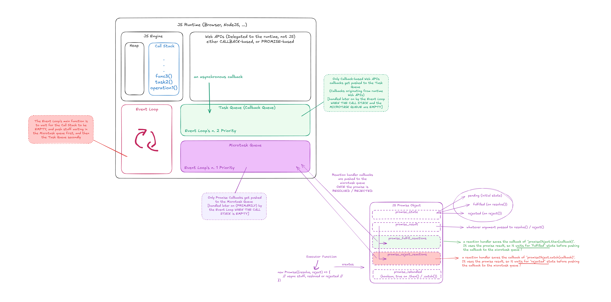
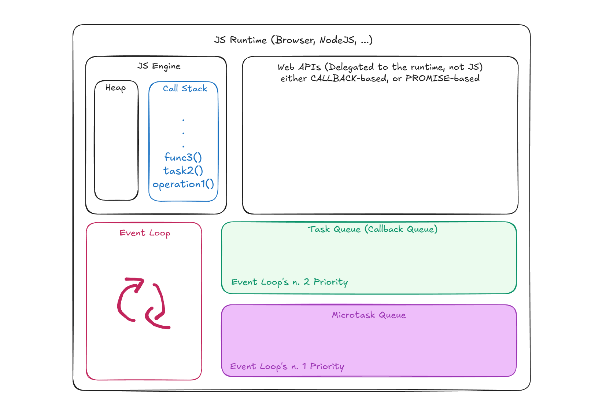
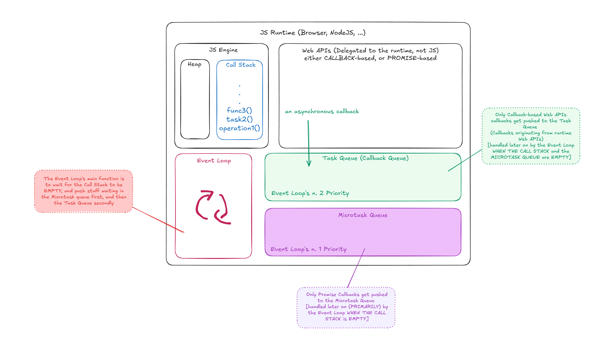
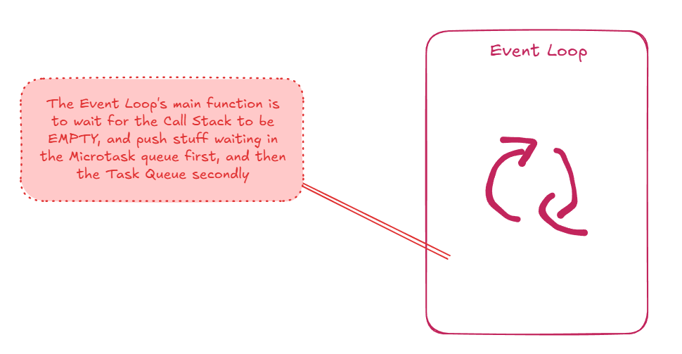
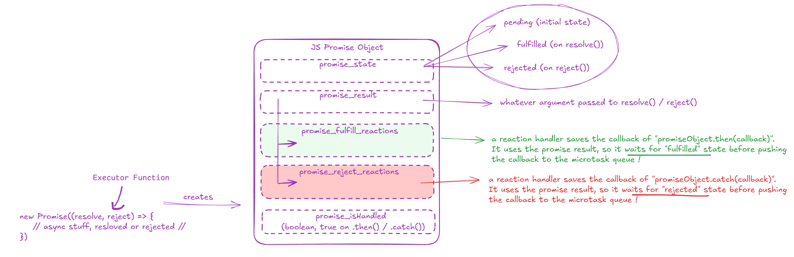
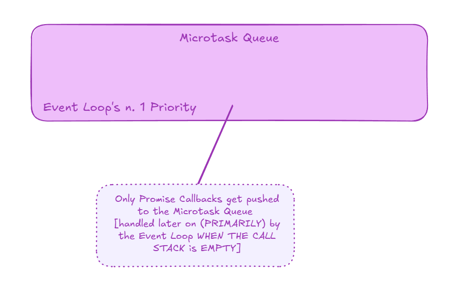
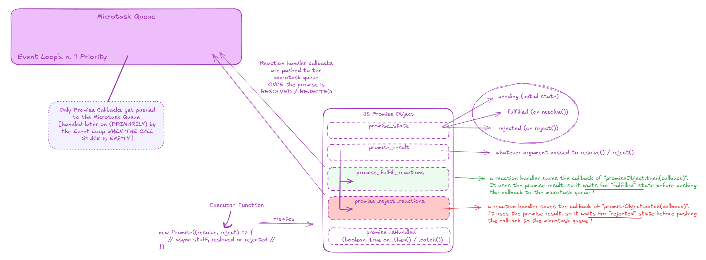

---
> **Last Updated:** November 8th, 2025
>
> **Author:** [Haitam Bidiouane](https://linkedin.com/in/haitam-bidiouane/) ([@sch0penheimer](https://github.com/sch0penheimer))
---

# The Asynchronous JavaScript Runtime: Event Loop, Callbacks, Tasks and Promises Explained

This repository is a compact, hands-on collection of JavaScript examples and notes that demonstrate how the event loop, callbacks, tasks, microtasks, promises, and async/await behave in practice. Each file is a focused snippet with explanatory comments so you can run and experiment with the examples (Using Node.js or even running them directly on a browser). Work through the files in order to build an intuition of asynchronous control flow and use them as a playground for learning, or follow-along this README !

> [!TIP]
> Every code snippet in this repository is hand-written, without a single AI-generated character, so to actually understand how stuff goes under the hood & follow along, I would recommend you to do the same :)

## Table of Contents

- [The JavaScript Runtime Debunked](#the-javascript-runtime-debunked)
- [Asynchronous Concepts](#asynchronous-concepts)
  - [Call Stack](#call-stack)
  - [Event loop & scheduling rules](#event-loop--scheduling-rules)
  - [Callbacks](#callbacks)
  - [Web APIs & Task Queue](#web-apis--task-queue)
  - [Promises](#promises)
  - [Microtask Queue](#microtask-queue)
  - [Promise Chaining](#promise-chaining)
  - [async / await](#async--await)
  - [Error handling (try/catch)](#error-handling-trycatch)
- [Examples (playground)](#examples-playground)
    1. [callbackBased_webAPI.js](#1-callbackbased_webapijs)
    2. [promise_init.js](#2-promise_initjs)
    3. [mashup.js](#3-mashupjs)
    4. [second_level/](#second_level)
         - [1_promise_chaining_init.js](#1_promise_chaining_initjs)
         - [2_pre_async_await.js](#2_pre_async_awaitjs)
         - [3_async_await.js](#3_async_awaitjs)
         - [4_final.js](#4_finaljs)

## The JavaScript Runtime Debunked

*Figure 1: The full JavaScript Runtime: An overview of Host, Engine, and Platform boundaries.*

At a general level, the JavaScript runtime is the environment that takes your code and executes it. It provides the synchronous execution context where functions run and also the plumbing that lets code interact with timers, I/O, and the host platform. Concretely, the runtime is composed of the engine that runs JavaScript (call stack, heap) and the host-provided systems that provide asynchronous primitives.

Going deeper, observable ordering and program behavior emerge from the interactions between the call stack, the host platform, and the runtime's scheduling subsystems. The host will convert operations such as timers and I/O into **callbacks**; the engine manages job queues that determine when those callbacks run relative to promise reactions. Use the diagrams below as a map for reasoning about how a given line of code transitions across these boundaries.

*Figure 2: The base JavaScript Runtime Components, with concise view of the Call Stack and Queues.*

## Asynchronous Concepts

*Figure 3: Runtime Components with detailed annotations and typical platform actors.*

This sections with highlight alll of the major async components: The call stack and the two primary queues: tasks (or macrotasks) and microtasks queues, callbacks and promises. 

The call stack executes synchronously; macrotasks are platform-driven callbacks; microtasks are promise jobs and other job-queue entries. The deterministic scheduling behavior in examples comes from those queues and their drain order.

### Call Stack

The call stack is the place where synchronous code executes in LIFO order. Any function call pushes a frame on the stack; its return pops it. For a developer this means that no JavaScript callback or promise reaction can start <ins>until the currently running stack **is emptied**</ins>.

Technically, the call stack represents the engine's active execution context. When asynchronous work completes at the host level, its associated callbacks are queued; the event loop will only invoke them when the stack is empty. Heavy synchronous work therefore blocks both macrotasks and microtasks until completion !

### Event loop & scheduling rules

At a basic level, the event loop is the mechanism that repeatedly picks work to execute and ensures asynchronous callbacks eventually run. It alternates between executing macrotasks and draining microtasks.

In more detail, the canonical scheduling cycle is: Whne the call stack is empty, drain the microtask queue fully, and then dequeue the task or macrotask queue. This ordering is why resolved promises execute earlier than timers scheduled to run afterward and why chaining microtasks can delay macrotasks.

*Figure 4: The JS Event Loop: macrotask & microtask draining/dequeueing cycle.*

### Callbacks

A callback is simply a function passed to another function to be invoked later. From an architectural perspective, callbacks provided to host APIs (for example setTimeout(callback, delay)) are scheduled by the host and executed as macrotasks.

### Web APIs & Task Queue

In JavaScript, Web APIs are the host-provided services that perform asynchronous work for the engine. The Task Queue (macrotask queue) is where the host places callbacks when those services complete.

Technically, each platform callback is enqueued into the task queue according to host rules. The queue is usually FIFO and each task runs in its own macrotask execution.

task_queue.png)

*Figure 5: The Task Queue and how platform callbacks enter it.*

### Promises

Conceptually, a Promise is an object representing the eventual result of an asynchronous operation. It lets you attach handlers for success or failure and composes nicely.

Under the hood, when a promise **SETTLES** (its state is FULLFILLED or REJECTED via resolve() or reject()), its reaction handlers, passed as callbacks by `.then(callback)`or `.catch(callback)` are scheduled as microtasks. `.then` returns a new promise whose resolution depends on the return value of the handler. 

Remember: promise handlers are always asynchronous with respect to the current synchronous code. Handlers run on the microtask queue WHEN THE CALL STACK IS EMPTY, even for already-resolved promises. This guarantees predictable ordering when mixing synchronous logs, microtasks, and macrotasks.

*Figure 6: The basic Promise object and its reaction mechanics.*

### Microtask Queue

At a surface level, the microtask queue is the queue used for short, high-priority jobs such as promise reactions. Microtasks run sooner than macrotasks and are drained fully after each macrotask.

In practice this means that promise `.then` handlers, `queueMicrotask`, and other job-queue items will always run whenn the call stack is empty and BEFORE MACROTASKS. Because microtasks can enqueue additional microtasks, unbounded microtask generation can starve macrotasks and prevent timers or rendering from occurring. Keep microtask workloads small and predictable.

*Figure 7.1: The microtask queue: The main queue targeted by the event-loop when the call stack is empty*

*Figure 7.2: Microtask queue entries with a Promise object lifecycle overlay.*

### Promise Chaining

At a basic level, promise chaining is the pattern of sequencing asynchronous operations by returning values or promises from `.then` handlers. This reads like synchronous code and allows stepwise transformations.

Detailing the mechanics: each `.then` installs a microtask that receives the settled value; the return value of that handler resolves the promise produced by `.then`. Returning a plain value results in `Promise.resolve(value)` for the next link. Returning a promise creates a waiting period until that promise settles, which controls when the subsequent `.then` handler runs. This microtask sequencing explains deterministic ordering in chains.

### async / await

`async`/`await` is syntax that makes promise-chaining code look synchronous. An `async` function returns a promise and `await` pauses **that function** (not the call stack!) until a promise settles.

Under the hood, `await` yields control back to the event loop and schedules the continuation as a microtask when the awaited promise resolves or rejects. Therefore continuations after `await` are executed before later macrotasks but after current microtasks drain. It also unwraps the returned promise into its "result" (whether resolved or rejected)

### Error handling (try/catch)

At the simplest level, `try/catch` is the pattern used to capture exceptions. With promises, `.catch` handles rejections; inside `async` functions a `try { await ... } catch (err) {}` construct captures rejected awaits.

Technically, errors thrown synchronously or via rejected promises propagate through promise chains unless handled. When you `await` a rejected promise, the rejection is raised as a synchronous exception inside the `async` function and can be caught with `try/catch`. Handling rejections is important to avoid unhandled rejection warnings and to make error flows explicit.

## Examples (playground)

Each example file is minimal and focused. Run through them **in order** to see how the concepts above manifest in logged output and in queue transitions.

### 1) callbackBased_webAPI.js  
Explores `setTimeout` macrotask scheduling and synchronous vs asynchronous ordering.

> **Check File**

> [1-callbackBased_webAPI.js](./1-callbackBased_webAPI.js)

### 2) promise_init.js  
Contrasts a timer macrotask with a promise microtask and demonstrates how microtasks run earlier.

> **Check File**

> [2-promise_init.js](./2-promise_init.js)

### 3) mashup.js  
Mixes `Promise.resolve().then(...)`, `queueMicrotask`, and `setTimeout` to exhibit the exact ordering of synchronous code, microtasks, and macrotasks.

> **Check File**

> [3-mashup.js](./3-mashup.js)

### second_level/  
Progression from chaining to `async/await` and rejection handling.

#### 1_promise_chaining_init.js 

- 1_promise_chaining_init.js: demonstrates promise chaining and how `.then` returns a new promise that feeds the next handler.

> **Check File**

> [second_level/1_promise_chaining_init.js](./second_level/1_promise_chaining_init.js)

#### 2_pre_async_await.js

- 2_pre_async_await.js: shows explicit `.catch` for rejection handling in chains.

> **Check File**

> [second_level/2_pre_async_await.js](./second_level/2_pre_async_await.js)

#### 3_async_await.js

- 3_async_await.js: presents the `async`/`await` equivalent of chained promises and highlights continuation scheduling.

> **Check File**

> [second_level/3_async_await.js](./second_level/3_async_await.js)

#### 4_final.js

- 4_final.js: explains `try/catch` usage inside async functions to handle rejections and matches `.catch` semantics.

> **Check File**

> [second_level/4_final.js](./second_level/4_final.js)